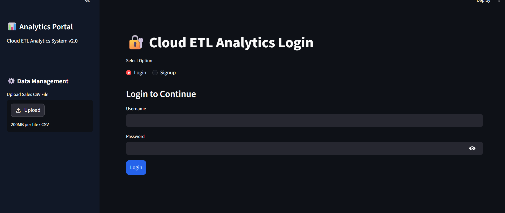
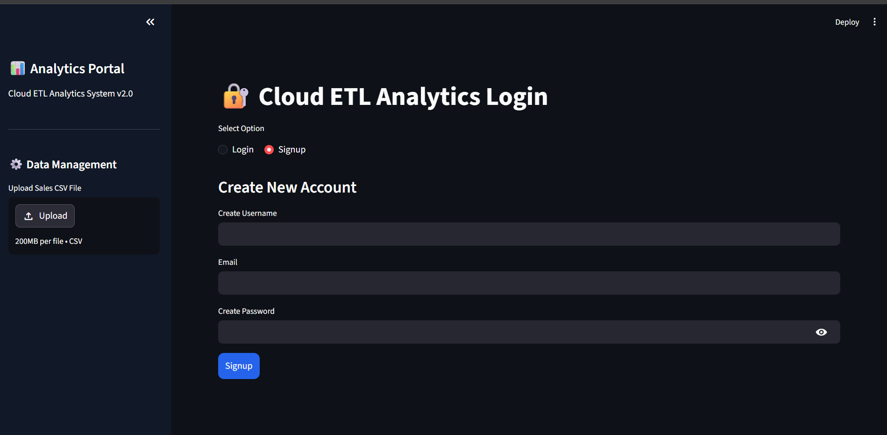
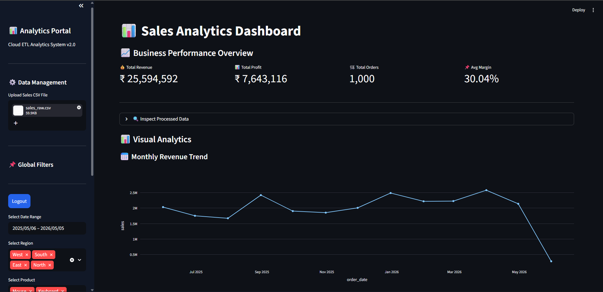
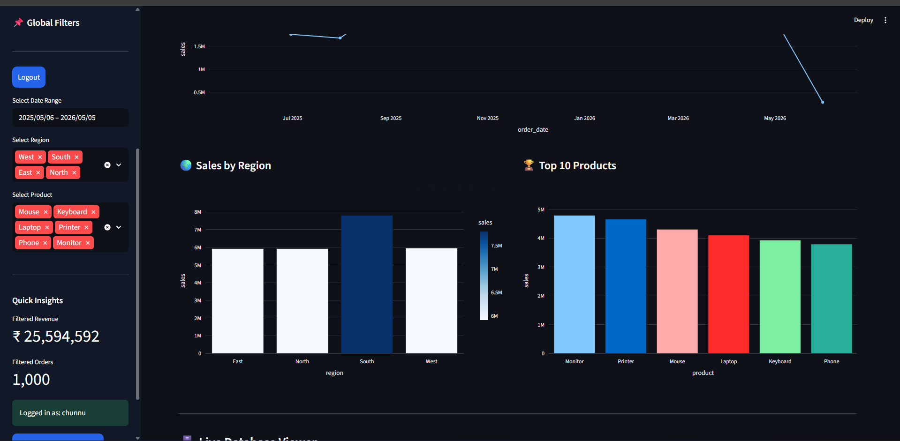
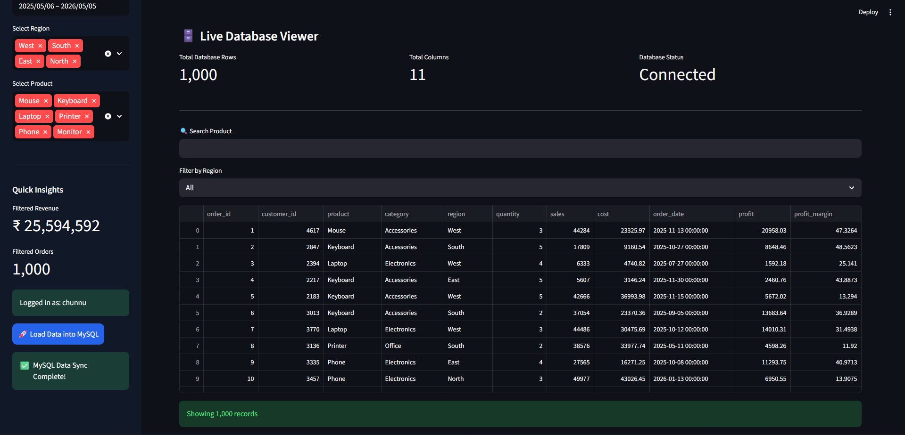
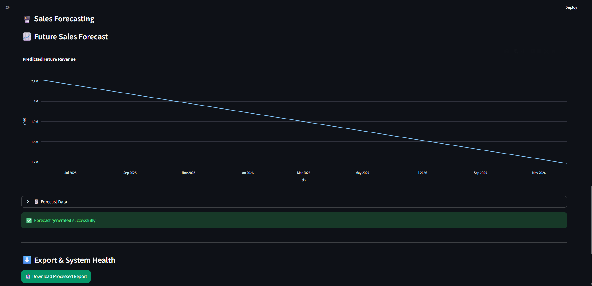

# 📊 Cloud ETL Sales Analytics Platform

An AI-powered full-stack analytics engineering project built using Python, Streamlit, MySQL, Plotly, and ETL pipelines.

This platform performs:
- Data ingestion
- ETL processing
- SQL warehousing
- Interactive analytics
- Authentication
- Forecasting
- Live database monitoring

---

# 🚀 Features

## ✅ ETL Pipeline
- Data cleaning
- Deduplication
- Null handling
- Profit calculations
- Margin calculations

## ✅ Authentication System
- User signup
- User login
- Session management
- Secure password hashing

## ✅ Interactive Dashboard
- KPI cards
- Revenue analytics
- Profit tracking
- Regional analysis
- Product performance

## ✅ MySQL Integration
- Live database sync
- Database viewer
- SQL-backed analytics

## ✅ Forecasting Module
- Future revenue prediction
- Time-series forecasting
- Predictive analytics

## ✅ Export Features
- Download processed CSV reports

---

# 🛠️ Tech Stack

| Technology | Purpose |
|---|---|
| Python | Backend Logic |
| Streamlit | Frontend Application |
| MySQL | Database |
| SQLAlchemy | Database ORM |
| Plotly | Interactive Visualizations |
| Pandas | Data Processing |
| Prophet | Forecasting |

---

# 📂 Project Structure

```bash
Cloud_ETL_Project/
│
├── app.py
├── styles.css
├── requirements.txt
├── README.md
│
├── auth/
├── database/
├── utils/
├── reports/
├── screenshots/
│
└── .streamlit/

📈 Dashboard Features
Interactive KPI analytics
Real-time database monitoring
Product & regional filtering
Forecasting visualizations
Exportable reports
🔐 Authentication Features
Secure login system
Password hashing
Session management
Protected dashboard access
🔮 Forecasting Engine

The platform uses Prophet time-series forecasting to predict future monthly sales trends and revenue growth.

⚙️ Installation Guide
1️⃣ Clone Repository
git clone <your-repository-link>
2️⃣ Create Virtual Environment
python -m venv venv
3️⃣ Activate Environment
Windows
venv\Scripts\activate
4️⃣ Install Requirements
pip install -r requirements.txt
5️⃣ Run Application
streamlit run app.py
📊 Future Enhancements
Cloud deployment
API ingestion
Automated ETL scheduling
Role-based access
Real-time analytics
Docker support
👨‍💻 Author

Nitin Mishra

⭐ Project Status

🚀 Advanced Analytics Engineering Project

# 📸 Application Screenshots

---

## 🔐 Login Page



---

## 📝 Signup Page



---

## 📊 Analytics Dashboard



---

## 📈 Advanced Dashboard Analytics



---

## 🗄️ Live Database Viewer



---

## 🔮 Forecasting Module

